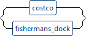
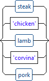
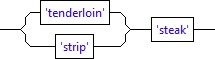
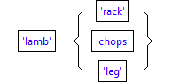
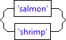
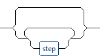
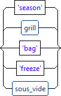
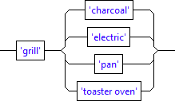
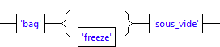

# Problem statement

There are many different ways to obtain nutrition. The ways explained in this book 
are intended to solve the following constrained optimization problem: "Maximize food 
quality and dining experience per calorie consumed while minimizing the shopping/cooking 
_active_ time and budget."

In other words we want our food be healthy and tasty while spending minimum _active 
time_ and money on food provisioning and preparation. _Active time_ means the time which 
requires human involvement. For example, some sous vide recipes take several hours or 
even days, but their _active time_ is just several minutes - put the food item in, set 
time and temperature, and then take the food item out when it is ready.

The cooking approaches described here attempt to minimize _active time_ in total and 
also to spread it over the calendar time. It also attempts to minimize the intensity 
of _active time_, or _mental effort_, i.e. the number of decisions to make and the number of things to keep 
in mind. Software developers have enough of cognitive load during their working hours.   

## Cooking grammar

Cooking described in this book consist from a series of steps, pretty much as a computer 
program. Therefore, we will use "cooking grammar" to describe the process:

```
nutrition: shop prepare 'consume';

shop: costco | fishermans_dock;

costco: 'Costco' costco_food;

costco_food: steak | 'chicken' | lamb | 'corvina' | pork;

steak : ('tenderloin' | 'strip') 'steak';

lamb: 'lamb' ('rack' | 'chops' | 'leg');

pork: 'pork' 'ribs';

fishermans_dock: 'Fisherman Dock' fd_food;

fd_food: 'salmon' | 'shrimp';

prepare: step*;

step: 'season' | grill | 'bag' | 'freeze' | sous_vide;

grill: 'grill' ('charcoal' | 'electric' | 'pan' | 'toaster oven'); 

sous_vide: 'bag' 'freeze'? 'sous_vide';  
```    

The full grammar project is available here - https://github.com/pvlasov/northeast-florida-geek-grilling-and-sous-vide/cooking-grammar.

### nutrition


This is the start rule of our grammar. The nutrition process includes provisioning of raw food, which in this book is shopping, 
food preparation and eventually consumption.

### shop



This book describes shopping in [Costco](https://www.costco.com/warehouse-locations/e-jacksonville-jacksonville-fl-357.html) and 
[Fisherman's dock](http://www.thefishermansdock.com/). In author's opinion these food 
stores provide good balance between food quality, variety and price. 

#### Costco

Costco has a vide variety of meats, but this book covers only some of them and shown below.


##### Costco food


###### Steak


###### Lamb


###### Pork


#### Fisherman's dock 

Fisherman's Dock also carries a wide variety of seafood, but this book covers only the 
whole salmon and headed shrimp. 

Filleted salmon and headless shrimp is also available in Costco.




### prepare

Food preparation contains several steps which can be sequenced in different combinations. 
Some steps such as cutting, thawing, and fridging are implicit due to their short _active 
time_ and/or low _mental load_.









Generally speaking, all steps are optional, e.g. some people slice and eat raw salmon. Examples 
of single-step cooking include: 

* Grilling without seasoning - to feel the taste of the meat.
* Sashimi - salmon with wasabi and soy sauce.

Some constraings are not explicitly explained in the grammar that the steps shall not repeat, such 
as:

* Steps shall not repeat.
* Freeze only bagged food.
* Bag only to freeze.

This [simple program](https://github.com/pvlasov/northeast-florida-geek-grilling-and-sous-vide/blob/master/cooking-grammar/src/us/vlasov/cooking/Cooking.java) 
computed 42 step sequences with 498 variations using the constraints listed above and 
assuming 3 types of seasonings per each food. In this book we are going to cover some 
sequences which include seasoning, grilling, sous vide, and freezing:

* season, sous_vide, freeze, grill
* sous_vide, freeze, season, grill
* season, grill, sous_vide, freeze
   
Which, taking variations of each step and assuming 3 variations for the seasoning step, 
results in 36 different ways to cook.

Each of the aforementioned sequences has its own characteristics which will be explained 
in the following chapters.


